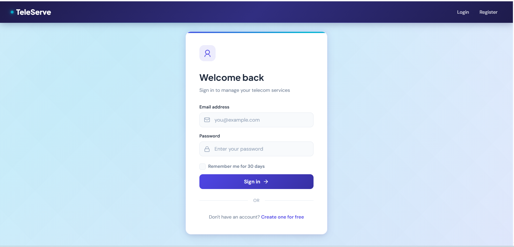
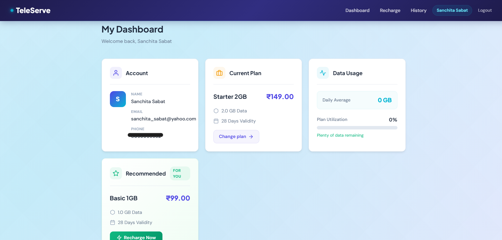
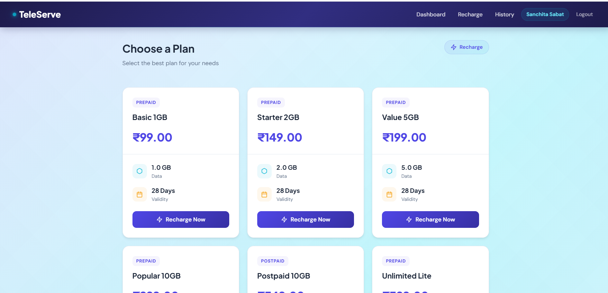
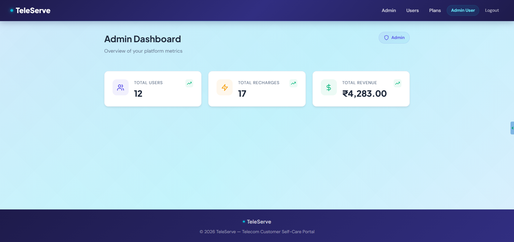
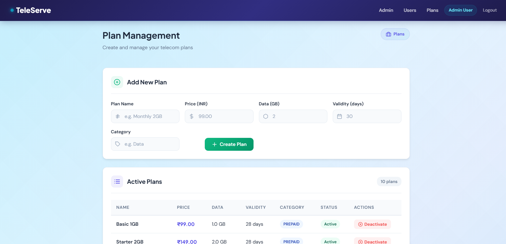

<div align="center">

# 📡 TeleServe — Telecom Customer Self-Care Portal

**A full-stack Java EE web application** that simulates a telecom self-care platform where customers can manage their accounts, recharge plans, track data usage, and more — while admins manage users and plans from a dedicated dashboard.

[](https://openjdk.org/)
[](https://javaee.github.io/servlet-spec/)
[](https://www.mysql.com/)
[](https://maven.apache.org/)
[](LICENSE)

[Features](#-features) · [Architecture](#-architecture) · [Tech Stack](#-tech-stack) · [Setup](#-setup--installation) · [Screenshots](#-screenshots) · [API Routes](#-api-routes)

</div>

---

## ✨ Features

### Customer Portal
- **Account Management** — Register, login, and manage profile
- **Plan Recharge** — Browse available plans, compare pricing, and recharge instantly
- **Usage Dashboard** — Track data consumption with visual progress indicators
- **Smart Plan Suggestions** — Rule-based recommendation engine suggests optimal plans based on usage patterns
- **Recharge History** — Paginated history of all transactions with status tracking
- **Remember Me** — Secure cookie-based persistent login (30-day token)

### Admin Panel
- **Dashboard Analytics** — Total users, recharges, and revenue at a glance
- **User Management** — View, activate, and suspend user accounts with pagination
- **Plan Management** — Create, view, and deactivate telecom plans

### Security & UX
- **BCrypt Password Hashing** — Industry-standard password security using jBCrypt
- **Session-based Authentication** — Servlet filter guards all protected routes
- **Role-based Access Control** — Separate `USER` and `ADMIN` roles with route-level enforcement
- **Remember Me Tokens** — UUID-based secure tokens with HTTP-only cookies
- **Input Validation** — Server-side validation on all forms
- **Responsive UI** — Modern design with animated gradients, smooth transitions, and mobile support

---

## 🏗 Architecture

```
┌─────────────┐     ┌──────────────┐     ┌──────────────┐     ┌─────────┐
│   Browser    │────▶│   Servlets   │────▶│   Services   │────▶│   DAOs  │
│  (JSP/CSS)   │◀────│ (Controllers)│◀────│(Business Logic│◀────│  (JDBC) │
└─────────────┘     └──────────────┘     └──────────────┘     └────┬────┘
                           │                                       │
                    ┌──────┴──────┐                          ┌─────┴─────┐
                    │   Filters   │                          │   MySQL   │
                    │(Auth Guard) │                          │  Database │
                    └─────────────┘                          └───────────┘
```

**Design Patterns Used:**
- **MVC Pattern** — Servlets (Controller) → Services (Model) → JSPs (View)
- **DAO Pattern** — Clean separation of data access logic from business logic
- **Service Layer Pattern** — Business rules isolated from controllers and DAOs
- **Front Controller** — Servlet filters for cross-cutting concerns (auth)
- **Singleton** — Database connection management via `DBConnection`

---

## 🛠 Tech Stack

| Layer | Technology |
|-------|-----------|
| **Language** | Java 11+ |
| **Web Framework** | Java EE (Servlets 4.0, JSP, JSTL) |
| **Database** | MySQL 8.0 with plain JDBC |
| **Security** | BCrypt (jBCrypt), HTTP-only cookies, session tokens |
| **Build Tool** | Apache Maven |
| **Server** | Apache Tomcat 7+ (embedded via Maven plugin) |
| **Frontend** | JSP, custom CSS with animations, SVG icons |
| **Architecture** | MVC + DAO + Service Layer (no Spring, no Bootstrap) |

> **Note:** This project intentionally uses **no frameworks** (no Spring, no Hibernate, no Bootstrap) to demonstrate strong fundamentals in Java EE, JDBC, and raw web development.

---

## 📁 Project Structure

```
TeleServe/
├── src/main/
│   ├── java/com/teleserve/
│   │   ├── controller/
│   │   │   ├── auth/          # LoginServlet, RegisterServlet, LogoutServlet
│   │   │   ├── user/          # DashboardServlet, RechargeServlet, HistoryServlet
│   │   │   └── admin/         # AdminDashboardServlet, UserMgmtServlet, PlanMgmtServlet
│   │   ├── model/             # User, Plan, Recharge, UsageLog, PaginatedResult
│   │   ├── dao/               # UserDAO, PlanDAO, RechargeDAO, UsageLogDAO
│   │   ├── service/           # AuthService, PlanService, RechargeService, AdminService
│   │   ├── filter/            # AuthFilter (authentication + remember me)
│   │   ├── listener/          # AppContextListener (dependency wiring)
│   │   ├── util/              # DBConnection, SessionUtil, PasswordUtil, AppLogger
│   │   └── exception/         # ServiceException, DAOException
│   └── webapp/
│       ├── WEB-INF/
│       │   ├── views/
│       │   │   ├── auth/      # login.jsp, register.jsp
│       │   │   ├── user/      # dashboard.jsp, recharge.jsp, history.jsp
│       │   │   ├── admin/     # dashboard.jsp, users.jsp, plans.jsp
│       │   │   └── shared/    # _header.jsp, _footer.jsp
│       │   └── web.xml
│       ├── db.properties
│       └── index.html
├── schema.sql                  # Database schema + seed data
├── pom.xml
└── README.md
```

---

## 🚀 Setup & Installation

### Prerequisites
- Java 11+ (JDK)
- MySQL 8.0+
- Apache Maven 3.x

### 1. Clone the Repository
```bash
git clone https://github.com/sanchita-88/TeleServe.git
cd TeleServe
```

### 2. Set Up the Database
```bash
mysql -u root -p
```
```sql
CREATE DATABASE teleserve;
CREATE USER 'teleserve_user'@'localhost' IDENTIFIED BY 'your_password';
GRANT ALL PRIVILEGES ON teleserve.* TO 'teleserve_user'@'localhost';
FLUSH PRIVILEGES;
```

Then run the schema:
```bash
mysql -u root -p teleserve < schema.sql
```

### 3. Configure Database Connection
Edit `src/main/webapp/db.properties`:
```properties
db.url=jdbc:mysql://localhost:3306/teleserve?useSSL=false&serverTimezone=UTC
db.user=teleserve_user
db.password=your_password
db.driver=com.mysql.cj.jdbc.Driver
```

### 4. Build & Run
```bash
mvn clean package tomcat7:run
```

### 5. Access the Application
Open your browser and navigate to:
```
http://localhost:8080/teleserve
```

### Default Credentials
| Role | Email | Password |
|------|-------|----------|
| Admin | admin@teleserve.com | password123 |
| User | rahul@example.com | password123 |

---

## 📸 Screenshots

### Login Page
> Modern login with animated gradient background, input icons, and Remember Me

<!-- Replace with actual screenshot -->
  

### User Dashboard
> Account overview, current plan, data usage with progress bar, and smart plan suggestion

<!-- Replace with actual screenshot -->
  

### Recharge Plans
> Card-based plan selection with pricing, data, and validity details

<!-- Replace with actual screenshot -->
  

### Admin Dashboard
> Platform metrics with animated stat cards

<!-- Replace with actual screenshot -->
  

### Admin — Plan Management
> Create and manage telecom plans with inline form and status badges

<!-- Replace with actual screenshot -->
  

---

## 🔗 API Routes

### Public Routes
| Method | Route | Description |
|--------|-------|-------------|
| GET/POST | `/login` | User authentication |
| GET/POST | `/register` | New user registration |
| GET | `/logout` | Session invalidation + cookie cleanup |

### User Routes (requires authentication)
| Method | Route | Description |
|--------|-------|-------------|
| GET | `/user/dashboard` | Account overview, plan, usage stats |
| GET/POST | `/user/recharge` | Browse and purchase plans |
| GET | `/user/history` | Paginated recharge history |

### Admin Routes (requires ADMIN role)
| Method | Route | Description |
|--------|-------|-------------|
| GET | `/admin/dashboard` | Revenue, user count, recharge stats |
| GET/POST | `/admin/users` | User management (activate/suspend) |
| GET/POST | `/admin/plans` | Plan CRUD operations |

---

## 🔒 Security Implementation

| Feature | Implementation |
|---------|---------------|
| **Password Storage** | BCrypt hashing via jBCrypt (cost factor 10) |
| **Authentication** | Session-based with `HttpSession` |
| **Remember Me** | UUID token stored in DB + HTTP-only cookie (30 days) |
| **Route Protection** | `AuthFilter` on `/user/*` and `/admin/*` |
| **Role Enforcement** | Filter checks `user.role` for `/admin/*` routes |
| **Session Management** | `SessionUtil` helper for clean session handling |
| **CSRF Protection** | POST-only state mutations |

---

## 📊 Database Schema

```
users ──────────── recharges ──────────── plans
 │ user_id (PK)     │ recharge_id (PK)     │ plan_id (PK)
 │ full_name         │ user_id (FK)         │ name
 │ phone (UNIQUE)    │ plan_id (FK)         │ price
 │ email (UNIQUE)    │ amount_paid          │ data_gb
 │ password_hash     │ recharged_at         │ validity_days
 │ role              │ expiry_date          │ category
 │ status            │ status               │ is_active
 │ remember_token    │                      │
 │ created_at        │                      │ created_at
 │                   │                      │
 └──── usage_log     │                      │
        │ log_id     │                      │
        │ user_id    │                      │
        │ date       │                      │
        │ data_used  │                      │
```

---

## 🎨 UI/UX Highlights

- **Animated Gradient Background** — Multi-layered CSS gradient waves with continuous motion
- **Smooth Page Transitions** — Staggered `fadeInUp` animations on cards, tables, and form fields
- **Interactive Elements** — Hover lift effects, icon color transitions, button glow shadows
- **Modern Typography** — Plus Jakarta Sans (headings) + DM Sans (body) from Google Fonts
- **Status Indicators** — Glowing dots, color-coded badges, progress bars with gradient fills
- **Responsive Design** — Fully responsive grid layouts adapting to mobile, tablet, and desktop
- **SVG Icons** — Inline SVGs for crisp rendering at any resolution (no external icon libraries)

---

## 🗺 Roadmap

- [ ] Forgot Password (email-based reset)
- [ ] Email Verification on Registration
- [ ] Delete Account
- [ ] Profile Edit
- [ ] Invoice PDF Generation
- [ ] Real-time Usage Notifications
- [ ] Dark Mode Toggle

---

## 👩‍💻 Author

**Sanchita**
- GitHub: [@sanchita-88](https://github.com/sanchita-88)

---

<div align="center">

Built with ☕ Java · No Frameworks · Pure Fundamentals

</div>
